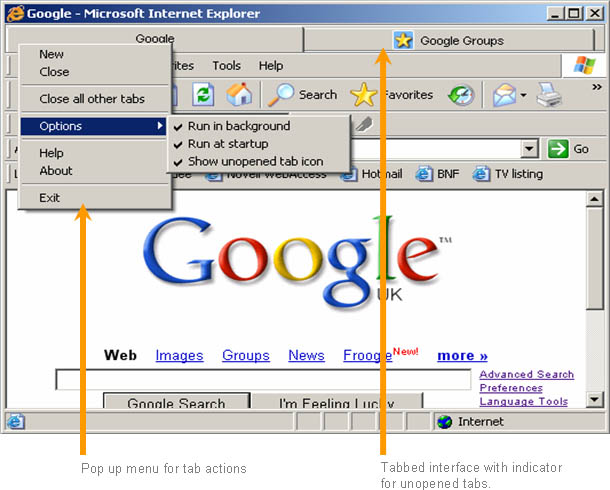



## IE Tabbed 4 \(Proper IE tabbing\)

### Description

Tab Internet Explorer windows in real time! This is a much more stable release of the previous versions and has a whole host of new features, including right click menu, running in the background and loading at start up. It also supports windows XP skins. It doesn’t need any extra controls for subclassing and source code is fully commented. Please see the screenshot. PLEASE COMPILE BEFORE RUNNING. (Please read the txt file before running the program)
 
### More Info
 

             |
---                |---
**Submitted On**   |2005-03-23 00:02:56
**By**             |[Niranjan Paudyal](https://github.com/Planet-Source-Code/PSCIndex/blob/master/ByAuthor/niranjan-paudyal.md)
**Level**          |Advanced
**User Rating**    |5.0 (25 globes from 5 users)
**Compatibility**  |VB 5\.0, VB 6\.0
**Category**       |[Internet/ HTML](https://github.com/Planet-Source-Code/PSCIndex/blob/master/ByCategory/internet-html__1-34.md)
**World**          |[Visual Basic](https://github.com/Planet-Source-Code/PSCIndex/blob/master/ByWorld/visual-basic.md)
**Archive File**   |[IE\_Tabbed\_1868093252005\.zip](https://github.com/Planet-Source-Code/niranjan-paudyal-ie-tabbed-4-proper-ie-tabbing__1-59640/archive/master.zip)

